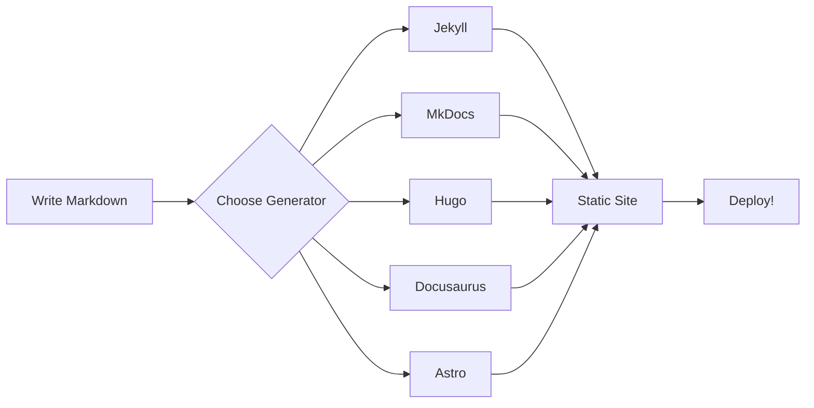

# Markdown Feature Showcase

This page demonstrates markdown features across different flavors. Not every
static site generator supports all of these!

## Basic Formatting

This is **bold**, this is *italic*, and this is ***both***. This is
`inline code`. This is ~~struck through~~.

## Links and Images

- [External link](https://powershellsummit.org)
- [Internal link](getting-started.md)


## Lists

### Unordered

- Item one
  - Nested item
    - Deeply nested item
- Item two

### Ordered

1. First
2. Second
3. Third

### Task List

- [x] Write the markdown
- [x] Choose a static site generator
- [ ] Deploy to production
- [ ] Profit

## Blockquotes

> This is a blockquote.
>
> > This is a nested blockquote.

## Tables

| Module | Version | Downloads |
|--------|--------:|----------:|
| Pester | 5.7.1 | 52M |
| PSScriptAnalyzer | 1.23.0 | 38M |
| Az | 13.0.0 | 32M |
| PSReadLine | 2.4.0 | 25M |

## Code Blocks

```powershell
# PowerShell
Get-Process | Where-Object CPU -gt 100 | Sort-Object CPU -Descending
```

```python
# Python (for the MkDocs fans)
import subprocess
result = subprocess.run(["pwsh", "-c", "Get-Date"], capture_output=True)
print(result.stdout.decode())
```

```yaml
# YAML front matter example
title: My Page
date: 2026-02-15
tags:
  - demo
```

## Footnotes

PowerShell was originally called Monad [^1]. It was created by Jeffrey
Snover [^2].

[^1]: The Monad Manifesto was published in 2002.
[^2]: Jeffrey Snover enjoys lobster rolls.

## Mermaid Diagram



## Math

Inline math: $E = mc^2$

Block math:

$$
\sum_{i=1}^{n} \frac{1}{i} \approx \ln(n) + \gamma
$$

## Horizontal Rule

---

## HTML in Markdown

<details>
<summary>Click to expand a collapsible section</summary>

This content is hidden by default. HTML `<details>` elements work in most
generators since they pass through raw HTML.

```powershell
# Secret PowerShell tip
Set-PSReadLineOption -PredictionSource HistoryAndPlugin
```

</details>

## Admonitions

> **Note**: This syntax works natively in some generators. MkDocs and Docusaurus
> have their own admonition syntax.

> **Warning**: Not all features render the same everywhere. That's the whole
> point of this demo!
